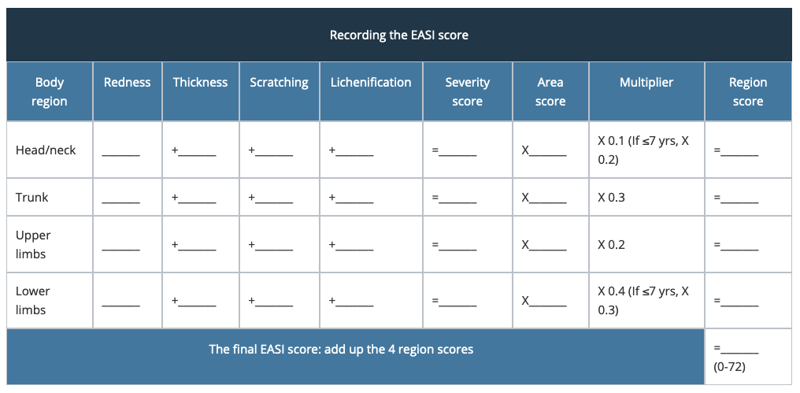

```{r set up, include=FALSE}
library(dplyr)
library(ggplot2)
library(ggpubr)
library(tidyr)
knitr::opts_chunk$set(echo=FALSE, dpi = 300, out.width = '80%', fig.align = 'center')
```

class: middle, center

# Atopic Dermatitis | Heterogeneity

--

disease severity

--

(dupiumab/traolokinumab) responder; non-responder

--

FLG mutation

--

early onset; late onset

--

Asian, Caucasian, African ... 

--

(comorbidity) asthma; contact allergen; food allergen


---

```{r AD_in_dark, out.width="70%", fig.align="center", cache=TRUE}
knitr::include_graphics("../../../multiomics-ad-transcriptomics/figure/AD_pathway_dark.png")
```

---

# Timeline

```{r echo=TRUE}
d <- c(as.Date("2022-10-31"), Sys.Date())
difftime(d[1], d[2], units = "days")
difftime(d[1], d[2], units = "weeks")
```

---

# People

```{r people_behind_the_scene, out.width='90%'}

```

---

class: center, middle, inverse

# Study design

Multi-omics Deep Phenotyping of Atopic Dermatitis in Time and Space

(PhD thesis working title);

Heterogeneous --> decompose heterogeneity

---

class: center, middle
```{r }

```

---

# Data 

.pull-left[

- Phenome

- Genotyping

  - SNP array

- **Transcriptome**
  
  - **Skin biopsy**
  
  - Tape striping

- Proteome

  - ~~Blood~~
]

.pull-right[

- Metabolome

  - Plasma
  
  - Urine

- Microbiome

  - Nose swabs
  
  - Skin swabs
]

---

class: middle, center, inverse

# Phenome

metadata; non-molecular data

---

# Phenome

### Baseline
  
```{r message=FALSE, warning=FALSE}
extensive_meta <- 
  readr::read_csv("../../../multiomics-ad-transcriptomics/data/RNAseq_sample_annotation(extensive).csv")

clinic_summary <- 
  extensive_meta %>% filter(visit == "01") %>% 
  select(subject, age, bmi, blood_ige, gender, group, easi_total_score, scorad, scorad_objective) %>% 
  distinct() %>% select(-subject) %>% group_by(group) %>% 
  summarize(no_subject = n(),
            female_percent = mean(gender == "female") * 100,
            age_mean = mean(age), age_sd = sd(age), 
            bmi_mean = mean(bmi), bmi_sd = sd(bmi), 
            blood_ige_mean = mean(blood_ige, na.rm = TRUE), blood_ige_sd = sd(blood_ige, na.rm = TRUE), 
            easi_mean = mean(easi_total_score), easi_sd = sd(easi_total_score), 
            scorad_mean = mean(scorad, na.rm = TRUE), scorad_sd = sd(scorad, na.rm = TRUE),
            oscorad_mean = mean(scorad_objective, na.rm = TRUE), oscorad_sd = sd(scorad_objective, na.rm = TRUE),
            ige_mean = mean(blood_ige, na.rm = TRUE), ige_sd = sd(blood_ige, na.rm = TRUE),
            ige_median = median(blood_ige, na.rm = TRUE))
```

|Characteristics|Patients(n=`r clinic_summary %>% filter(group == "AD") %>% pull(no_subject)`)|Controls(n=`r clinic_summary %>% filter(group == "CO") %>% pull(no_subject)`)|
|--------------:|--------------:|----:|
|Female (%)|`r clinic_summary %>% filter(group == "AD") %>% pull(female_percent) %>% round(2)`|`r clinic_summary %>% filter(group == "CO") %>% pull(female_percent) %>% round(2)`|
|Age at enrollment, mean ± sd| `r clinic_summary %>% filter(group == "AD") %>% pull(age_mean) %>% round(2)` ± `r clinic_summary %>% filter(group == "AD") %>% pull(age_sd) %>% round(2)` | `r clinic_summary %>% filter(group == "CO") %>% pull(age_mean) %>% round(2)` ± `r clinic_summary %>% filter(group == "CO") %>% pull(age_sd) %>% round(2)`|
|BMI, mean ± sd| `r clinic_summary %>% filter(group == "AD") %>% pull(bmi_mean) %>% round(2)` ± `r clinic_summary %>% filter(group == "AD") %>% pull(bmi_sd) %>% round(2)` |`r clinic_summary %>% filter(group == "CO") %>% pull(bmi_mean) %>% round(2)` ± `r clinic_summary %>% filter(group == "CO") %>% pull(bmi_sd) %>% round(2)` |
|serum IgE, mean ± sd | `r clinic_summary %>% filter(group == "AD") %>% pull(blood_ige_mean) %>% round(2)` ± `r clinic_summary %>% filter(group == "AD") %>% pull(blood_ige_sd) %>% round(2)` | `r clinic_summary %>% filter(group == "CO") %>% pull(blood_ige_mean) %>% round(2)` ± `r clinic_summary %>% filter(group == "CO") %>% pull(blood_ige_sd) %>% round(2)` |
|serum IgE, median | `r clinic_summary %>% filter(group == "AD") %>% pull(ige_median) %>% round(2)` | `r clinic_summary %>% filter(group == "CO") %>% pull(ige_median) %>% round(2)` |
|EASI, mean ± sd| `r clinic_summary %>% filter(group == "AD") %>% pull(easi_mean) %>% round(2)` ± `r clinic_summary %>% filter(group == "AD") %>% pull(easi_sd) %>% round(2)`  | - |
|SCORAD, mean ± sd|`r clinic_summary %>% filter(group == "AD") %>% pull(scorad_mean) %>% round(2)` ± `r clinic_summary %>% filter(group == "AD") %>% pull(scorad_sd) %>% round(2)` | - |
|oSCORAD, mean ± sd|`r clinic_summary %>% filter(group == "AD") %>% pull(oscorad_mean) %>% round(2)` ± `r clinic_summary %>% filter(group == "AD") %>% pull(oscorad_sd) %>% round(2)` | - |

---

# Disease severity

- EASI: Eczema Area and Severity Index <sup>1</sup>.

- SCORAD: SCORing Atopic Dermatitis <sup>2</sup>.

.footnote[
[1] https://dermnetnz.org/topics/easi-score/

[2] https://dermnetnz.org/topics/scorad/
]

---

class: center, middle

```{r fig.align='center', out.width='100%'}

```

---

class: middle

The SCORAD for that individual is **A/5 + 7B/2 + C**

A: area

B: intensity

C: subjective symptoms

---

# Phenome

### No Linear Correlation between EASI and SCORAD

```{r message=FALSE, warning=FALSE, dpi=300, out.width='50%', fig.align='center'}
disease_severity <- 
  extensive_meta %>% filter(group == "AD") %>% 
  select(subject, visit, easi_total_score, scorad) %>% distinct()

disease_severity %>% 
  ggplot(aes(easi_total_score, scorad)) + geom_point() +
  theme_classic() +
  xlab("EASI Score") +
  ylab("SCORAD")
```

---

class: middle

```{r out.width='70%'}
time_course_ad_subject <- 
  extensive_meta %>% filter(visit == "02", group == "AD") %>% pull(subject) %>% unique

extensive_meta %>% 
  dplyr::filter(subject %in% time_course_ad_subject) %>% 
  dplyr::select(-skin_type) %>% 
  distinct() %>% 
  ggplot(aes(visit_no, easi_total_score, color = subject)) + 
  geom_line() +
  ggthemes::theme_clean() + xlab("Visit") + ylab("EASI Score") + 
  ggtitle("EASI Score: the Longitudinal Change")
```

---

class: middle

```{r out.width='70%'}
extensive_meta %>% 
  dplyr::filter(subject %in% time_course_ad_subject) %>% 
  dplyr::select(-skin_type) %>% 
  distinct() %>% 
  ggplot(aes(visit_no, scorad, color = subject)) + 
  geom_line() +
  ggthemes::theme_clean() + xlab("Visit") + ylab("SCORAD") + ggtitle("SCORAD: the Longitudinal Change")
```

---

class: middle

```{r out.width='70%'}
extensive_meta %>% 
  dplyr::filter(subject %in% time_course_ad_subject) %>% 
  dplyr::select(-skin_type) %>% 
  distinct() %>% 
  ggplot(aes(visit_no, scorad_objective, color = subject)) + 
  geom_line() +
  ggthemes::theme_clean() + xlab("Visit") + ylab("oSCORAD") + ggtitle("oSCORAD: the Longitudinal Change")
```

---

background-image: url(https://upload.wikimedia.org/wikipedia/commons/thumb/3/3e/Vale_dos_Frades.jpg/1920px-Vale_dos_Frades.jpg)

???

Image credit: [Shooterb9](https://upload.wikimedia.org/wikipedia/commons/thumb/3/3e/Vale_dos_Frades.jpg/1920px-Vale_dos_Frades.jpg)

---

```{r}
disease_severity <- extensive_meta %>% 
  dplyr::filter(subject %in% time_course_ad_subject) %>% 
  dplyr::select(-skin_type) %>% 
  distinct() %>% 
  dplyr::select(visit, visit_quarter, subject, 
                easi_total_score, scorad_objective, scorad) %>% 
  tidyr::pivot_longer(cols = c("easi_total_score",
                               "scorad_objective",
                               "scorad"), 
                      names_to = "disease_severity") %>% 
  filter(subject != "AD_11") %>% 
  mutate(disease_severity = 
            case_when(disease_severity == "easi_total_score" ~ "EASI",
                      disease_severity == "scorad" ~ "SCORAD",
                      disease_severity == "scorad_objective" ~ "oSCORAD"),
         disease_severity = forcats::fct_relevel(disease_severity,
                                                 c("EASI", 
                                                   "SCORAD",
                                                   "oSCORAD")),
         visit = visit %>% as.character(),
         visit_quarter = visit_quarter %>% as.character())

disease_severity %>% select(-visit) %>% 
  rename(visit = visit_quarter) %>% mutate(visit_type = "quarter") %>% 
  bind_rows(disease_severity %>% select(-visit_quarter) %>% 
  mutate(visit_type = "visit") %>% 
    mutate(visit = paste0("V", visit %>% as.numeric()))) %>% 
  ggboxplot(x = "visit", 
            y = "value", 
            add = "point", 
            color = "visit", xlab = FALSE, ylab=FALSE) %>%
  facet(facet.by = c("disease_severity", "visit_type"), nrow = 3, scales = "free") %>% 
  ggpubr::set_palette("npg")
```

---

```{r disease_severity_natural_calendar, echo=FALSE, fig.align='center', message=FALSE, warning=FALSE, dpi=300}
disease_severity_natural_year <- extensive_meta %>% 
  dplyr::filter(subject %in% time_course_ad_subject) %>% 
  dplyr::select(-skin_type) %>% 
  distinct() %>% 
  mutate(year = date_visit %>% format("%Y"),
         year_quarter = paste0(year, visit_quarter)) %>% 
  dplyr::select(visit, visit_quarter, year_quarter, subject, 
                easi_total_score, scorad_objective, scorad) %>% 
  tidyr::pivot_longer(cols = c("easi_total_score",
                               "scorad_objective",
                               "scorad"), 
                      names_to = "disease_severity") %>% 
  filter(subject != "AD_11") %>% 
  mutate(disease_severity = 
            case_when(disease_severity == "easi_total_score" ~ "EASI",
                      disease_severity == "scorad" ~ "SCORAD",
                      disease_severity == "scorad_objective" ~ "oSCORAD"),
         disease_severity = forcats::fct_relevel(disease_severity,
                                                 c("EASI", 
                                                   "SCORAD",
                                                   "oSCORAD")),
         visit = visit %>% as.character(),
         visit_quarter = visit_quarter %>% as.character())

disease_severity_natural_year %>% 
  ggplot(aes(year_quarter, value, group = subject, color = subject)) +
  geom_point() + geom_line() + facet_grid(disease_severity~., scales = "free_y") +
  theme(axis.text.x = element_text(angle = 45, hjust = 1)) +
  xlab("Time")
```


---

# Valley

## P-values (linear mixed effect model)

```{r linear mixed effect model, message=FALSE, warning=FALSE}
lme <- 
disease_severity %>% distinct() %>% group_by(disease_severity) %>% tidyr::nest() %>% 
  mutate(stat_visit = purrr::map(data, function(data){
    lme <- nlme::lme(fixed = value ~ visit,
                     data,
                     random = ~ 1 | subject)
    lme_tidy <- broom.mixed::tidy(lme)
    return(lme_tidy)
  }),
        stat_quarter =  purrr::map(data, function(data){
    lme <- nlme::lme(fixed = value ~ visit_quarter,
                     data,
                     random = ~ 1 | subject)
    lme_tidy <- broom.mixed::tidy(lme)
    return(lme_tidy)}))

lme_visit <- lme %>% select(disease_severity, stat_visit) %>% tidyr::unnest(cols = c(stat_visit)) %>% 
  filter(effect == "fixed", term != "(Intercept)") %>% select(disease_severity, term, p.value) %>% 
  tidyr::pivot_wider(names_from = term, values_from = p.value)

lme_quarter <- lme %>% select(disease_severity, stat_quarter) %>% tidyr::unnest(cols = c(stat_quarter)) %>% 
  filter(effect == "fixed", term != "(Intercept)") %>% select(disease_severity, term, p.value) %>% 
  tidyr::pivot_wider(names_from = term, values_from = p.value)

lme_visit_quarter <- 
  left_join(lme_visit, lme_quarter) %>% 
  rename(Q2 = visit_quarterQ2,
         Q3 = visit_quarterQ3,
         Q4 = visit_quarterQ4)

```

```{r datatable,echo=FALSE, message=FALSE, warning=FALSE, cache=FALSE}
lme_visit_quarter %>%
  DT::datatable(rownames = FALSE, colnames = c(" " = 1)) %>% 
  DT::formatRound(2:8, digits = 3) %>%
  DT::formatStyle(2:8, color = DT::styleInterval(c("0.01", "0.05"),
                                               c("#CC0033", "#FF6666", "grey")))
```

---

# Phenome

### IgE

```{r message=FALSE, warning=FALSE, out.width='70%', fig.height=5}
ige <- 
  extensive_meta %>% filter(visit == "01") %>% 
  select(group, subject, visit, blood_ige) %>% distinct()

# ige %>% 
#   ggplot(aes(group, blood_ige)) + 
#   geom_boxplot() + geom_jitter(width = .2) +
#   scale_y_log10()

ige %>% 
  ggpubr::ggboxplot(x = "group", y = "blood_ige", 
                    add = "jitter", xlab = "Group", ylab = "Blood IgE") + 
  ggpubr::yscale("log10") +
  ggpubr::stat_compare_means() +
  ggpubr::stat_compare_means(method = "t.test", vjust = 2)

```

---

# Phenome

### Intrinsic vs Extrinsic AD

```{r warning=FALSE, fig.height=4.5}
ige %>% 
  ggpubr::gghistogram(x = "blood_ige", y="..count..", 
                      # facet.by = "group", 
                      add = "median", 
                      xlab = "Blood IgE", color = "group", fill = "group") %>%  
  ggpubr::facet("group", nrow = 2) %>%
  ggpubr::ggpar(xscale = "log10")
```

.footnote[
 --- : the dash line shows the median
]
---

# Phenome

### Intrinsic vs Extrinsic AD

.pull-left[

- Extrinsic AD

  - allergic AD; 
  
  - high total serum IgE; 
  
  - classic type; 
  
  - high prevalence (70 - 80%); 
  
  - skin barrier pertubed
]

.pull-right[
- Intrinsic AD

  - late onset
  
  - milder severity
  
  - skin barrier not pertubed
  
  - incidence (~ 20%)
]

.footnote[Tokura Y. Extrinsic and intrinsic types of atopic dermatitis. J Dermatol Sci. 2010;58(1):1-7. doi:10.1016/j.jdermsci.2010.02.008]

---

class: middle, center, inverse

# Genome

under power (30 + 30); 

SNP data --> genotype (?)

---

```{r genotyping data, message=FALSE, warning=FALSE}
readr::read_csv("../../../multiomics-ad-genome-a4086/data/model/FLG.csv")
```


---


class: middle, center

```{r}

```


---

class: middle, center, inverse

# Transcriptome

The most informative omics layer;

Data quality, RNA quality

```{r load RNA-seq data, message=FALSE, warning=FALSE}
suppressMessages(library(SummarizedExperiment))
suppressMessages(library(ggthemes))

RNA_seq <- readr::read_rds("../../../multiomics-ad-phd/data/se.rds")
```

---

# Transcriptome

### We're analyzing the largest AD skin transcriptome!

```{r stat, fig.height=4.5}
sample_n_stat_LEO <- 
  tibble(study = "LEOPharma_Multiomics_PhD",
         skin_type = c("NN", "AD_NL", "AD_LS"),
         n_sample = c(sum(colData(RNA_seq)$skin_type == "NN"), 
                    sum(colData(RNA_seq)$skin_type == "NL"), 
                    sum(colData(RNA_seq)$skin_type == "LS")))
sample_n_stat_GSE121212 <- 
  tibble(study = "GSE121212",
         skin_type = c("AD_LS","AD_NL","PSO_LS","PSO_NL","NN"),
         n_sample = c(27,27,28,27,38))
sample_n_stat_TREAT <-
  tibble(study = "TREATgermany",
         skin_type = c("AD_LS_prior_treat" , "AD_NL_prior_treat", "AD_LS_post_treat", "AD_NL_post_treat", "NN"),
         n_sample = c(57,54,30,27,31))
bind_rows(sample_n_stat_LEO, sample_n_stat_GSE121212, sample_n_stat_TREAT) %>% 
  mutate(study_f = factor(study, 
                          levels = c("LEOPharma_Multiomics_PhD","GSE121212","TREATgermany"))) %>% 
  ggplot(aes(skin_type, n_sample)) + 
  geom_bar(stat = "identity") + 
  facet_grid(.~ study_f, scales = "free_x") + 
  ggpubr::rotate_x_text(angle = 45) +
  theme_hc() +
  xlab("Skin Type") +
  ylab("Number of Samples") +
  ggtitle("The Number of Transcriptomes from Different Studies") +
  theme(plot.title = element_text(hjust = 0.5))
```

---

# Transcriptome

```{r eval=FALSE, message=FALSE, warning=FALSE, include=FALSE}
library(tidybulk, quietly = TRUE)
library(tidySummarizedExperiment, quietly = TRUE)

RNA_seq[c("ALOX15", "CCL1", "CCL17", "CCL18", "CCR5", "CCR7", "IL6R"),] %>% 
  ggplot(aes(replicate_ID, counts_scaled)) + geom_point() + 
  facet_wrap(feature ~ skin_type, scales = "free")
```

```{r out.width='90%'}

```

---

# Transcriptome

```{r message=FALSE, warning=FALSE}
library(googledrive)
library(googlesheets4)
library(DT)
gs4_auth(email = "tu.hu.ucph@gmail.com", token = drive_token())
sample_qc_record_url <- 
  googledrive::drive_ls("multiomics-ad-transcriptomics/") %>% 
  filter(name == "sample_qc_record") %>% 
  pull(id)
sample_qc_record_edited <-
  googlesheets4::read_sheet(ss = sample_qc_record_url)

sample_qc_record_edited %>% 
  datatable(rownames = FALSE, width = '110%',
            options = list(scrollX = TRUE, pageLength = 5)) %>% 
  formatRound(columns = c("r_LS", "r_NL", "r_NN", "r_replicate"))

```

---

# Transcriptome

[Bookdown](file:///Users/tuhu/Projects/multiomics-ad-phd/_book/index.html)

[Previous presentation](file:///Users/tuhu/Projects/multiomics-ad-transcriptomics/Rmd/phd_project_update.html#1)

---

class: center, middle, inverse

# Proteome

Very poor data quality from Sciomics --> Not included in the thesis

---

class: center, middle, inverse

# Metabolome

Surprising biomarker results

---

# Metabolome

### Untargeted metabolomics

```{r out.width='70%'}
knitr::include_graphics("https://cdn.vanderbilt.edu/vu-wp0/wp-content/uploads/sites/166/2018/06/19134150/Metabolomics_Varieties_500.jpg")
```

---

# Metabolome

## Serum

AD and CO can't be distinguished.

---

# Metabolome

## Urine

- A few dietary markers (whole grain intake, vegetable and fruit intake, wine consumption) distinguished AD and CO; 

- AD lives a healthy lifestyle than CO.

---

# Microbiome

- dada2 --> ASV table

- Staphylococcus aureus (AD > CO)

- diversity (AD < CO)

---

class: center, middle, inverse

# PhD Thesis as a Data Product


