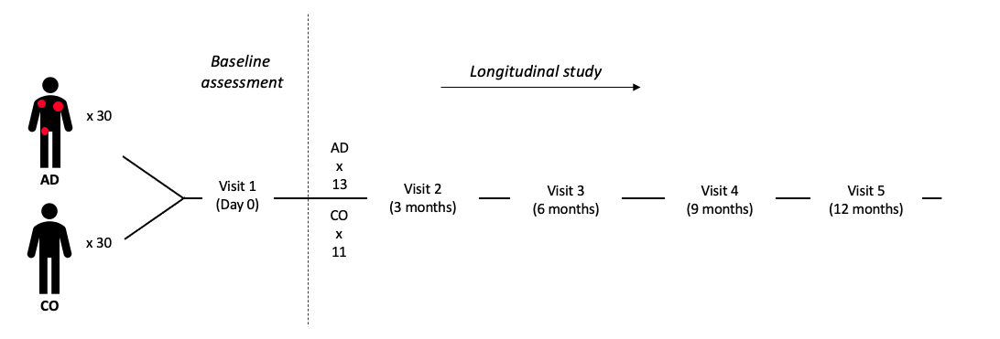

```{r, include=FALSE}
knitr::opts_chunk$set(results = 'asis',
                      echo = FALSE,
                      warning = FALSE,
                      tidy = FALSE,
                      message = FALSE,
                      fig.align = 'center',
                      out.width = "100%")
options(knitr.table.format = "html") 
```

```{r myplot, include=FALSE}
svg('myplot.svg')
plot(iris$Sepal.Length, iris$Sepal.Width)
dev.off()
```

# Introduction

- Atopic dermatitis (AD) is a common inflammatory skin disorder. 

- We performed a **multi-omics** analysis to gain a deeper understanding of AD pathophysiology.

# Methods
```{r dpi=450}

```

Phenome: a physician-led 106-item questionnaire, including lifestyle, family and history disease

Genome: SNP array

Transcriptome: AD lesional and non-lesional ; tape striping

Proteome: Sciomics from blood

Metabolome: LC-MS based profiling from serum and urine

Microbiome: 16S rRNA from nose and skin swabs

# Abstract

of 30 AD and 30 healthy control (CO) subjects, of which a sub-group was followed for up to one year. We profiled the genome using SNP genotyping, transcriptome using RNA-seq from 1.5 mm punch skin biopsies, metabolome using LC-MS from urine and serum, microbiome using 16S rRNA sequencing from skin swabs, and phenome by a 106-item questionnaire in addition to clinical tests. SNP genotyping identified FLG mutation (rs34806697) as the most discriminating genetic factor between AD and CO. The AD skin transcriptome comprised >1600 genes, enriched for epidermal differentiation and cytokine and chemokine induced inflammation. When evaluating the stability of the AD signature, we found that individual and technical factors were dominating, followed by variations in time and space. Metabolomics profiling did not identify any serum biomarkers that could distinguish AD from CO, while the urine metabolome suggests that AD subjects live a healthier lifestyle than CO. The microbiome of AD skin showed less diversity and higher abundance of Staphylococcus aureus compared with CO. In conclusion, AD patients show common but also diverse features in the multi-omics space.

```{r, include=FALSE}
knitr::write_bib(c('posterdown', 'rmarkdown','pagedown'), 'packages.bib')
```


# References

<!-- ?pagedown::chrome_print -->
